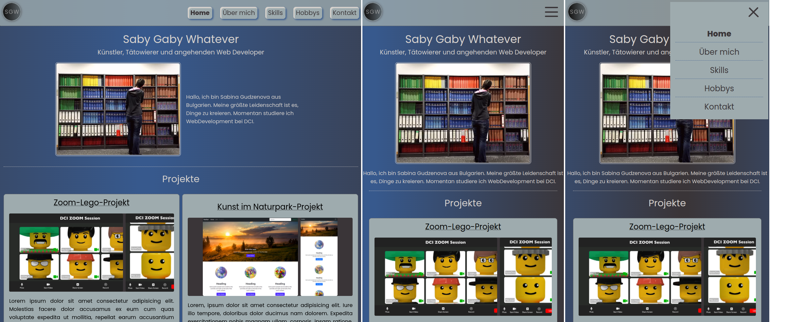

# project

**[take a look at the final product](https://saby-gaby.github.io/project/)**

### Navigation

- About Project
    - _Portfolio page that I created as a project at the end of module UI-Basics in my training at DCI._
    - _Developed with HTML5, SCSS, npm, git._
- Contact
    - _sgudzenova@gmail.com_
    - _https://github.com/saby-gaby_
    - _https://www.linkedin.com/in/sabina-gudzenova-3a8753234/_
- Used Tools
    - _Fonts_
    - _Design_
    - _Icons_
    - _Colors_
    - _Animation_

---

### About Project

I started this project as a test of what I learned during the first module of my dci training. The idea was to combine what I had learned so far into a complete project and to try the process in practice. I also know that I will need a portfolio in the future and I think this is a good basis for further development.

### How to use this Project

You can see the final product or view its code.

#### ##### Developed With

- [x] _HTML5_
- [x] _SASS_
- [x] _SCSS_
- [x] _npm_
- [x] _git_

### Contact

Mail: <sgudzenova@gmail.com> 
GitHub: [saby-gaby](https://github.com/saby-gaby) 
LinkedIn: [Sabina Gudzenova](https://www.linkedin.com/in/sabina-gudzenova-3a8753234/)

---

### Used Tools

- [npm](https://www.npmjs.com/)
- [Google Fonts](https://fonts.google.com/)
- [Visual Studio Code](https://code.visualstudio.com/)
- [Font Awesome](https://www.colorzilla.com/chrome/)

---

Have a nice and sunny day! 🌞